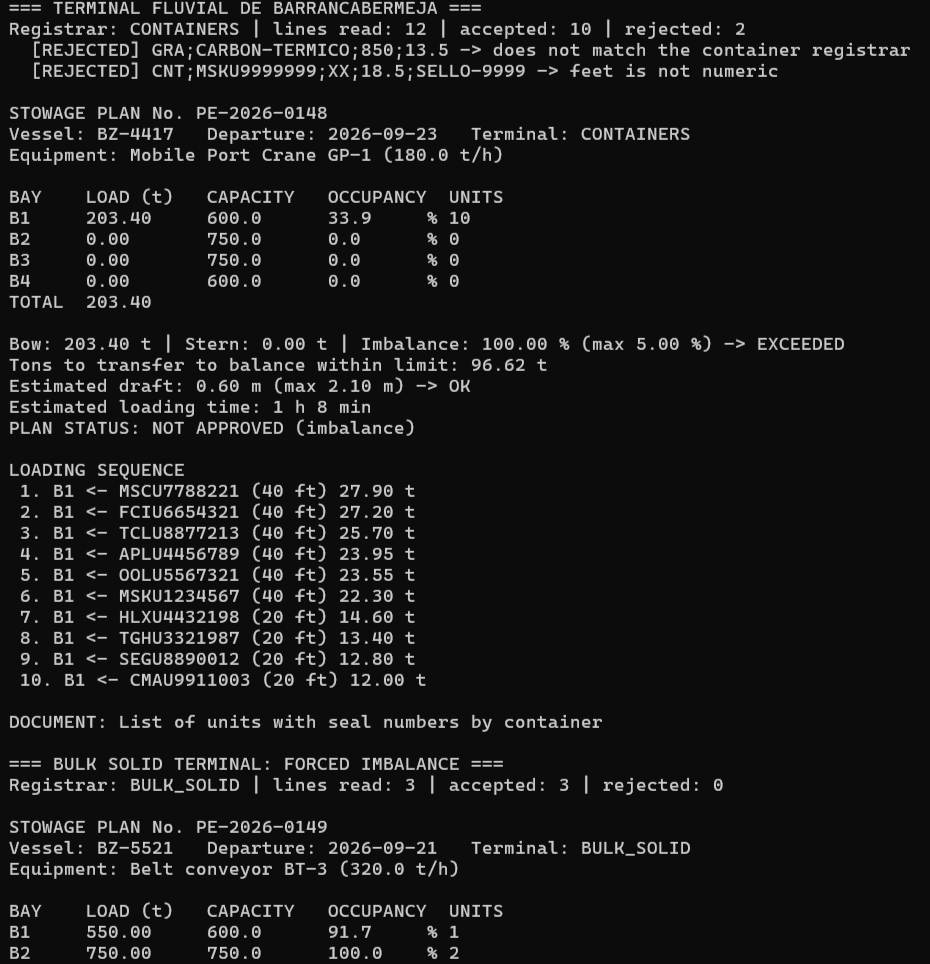
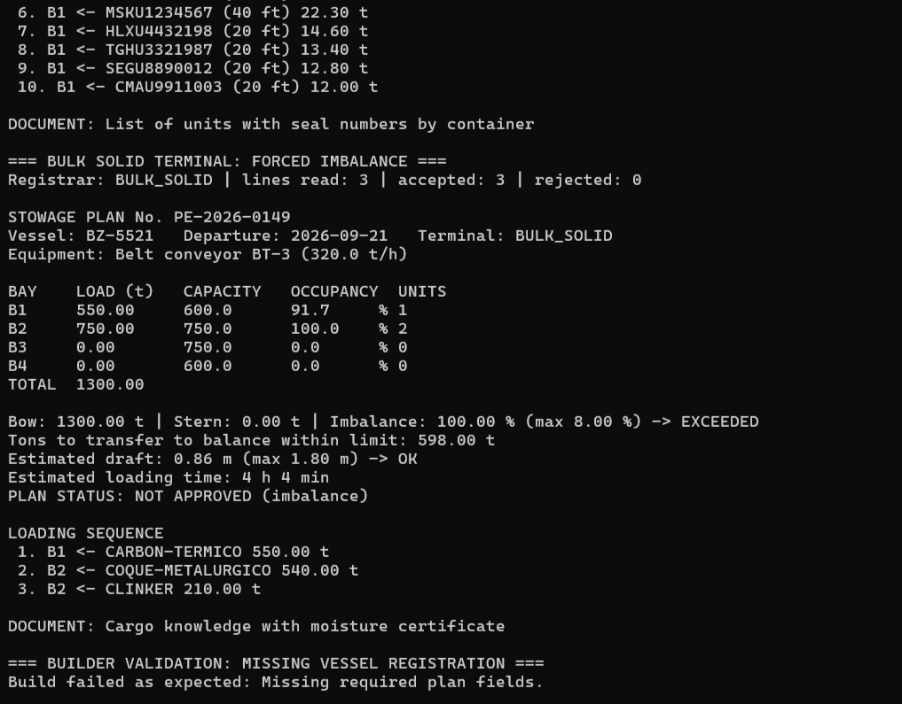

# Taller-evaluativo-patrones-caso-2

Console app in Java (SE 17+) that builds a stowage plan for a river terminal.

## Patterns used

- **Abstract Factory** — `factory/TerminalFactory` + `BulkTerminalFactory`, `ContainerTerminalFactory`, `LiquidTerminalFactory`. Creates the equipment, validator and document for each terminal type together, so they always match.
- **Factory Method** — `manifest/ManifestRegistrar` + `ContainerManifestRegistrar`, `BulkManifestRegistrar`, `LiquidManifestRegistrar`. Each one parses its own manifest line format and formula.
- **Builder** — `model/StowagePlan` + its `Builder`. Builds the plan step by step and validates it before creating it.
- **Singleton** — `service/Bays`. Only one shared instance holds the bay capacities, accessed with `Bays.getInstance()`.

## Run

```bash
javac -d out $(find main/java -name "*.java")
java -cp out app.Main
```

## Screenshots


